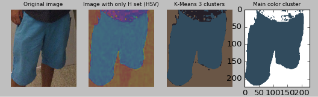
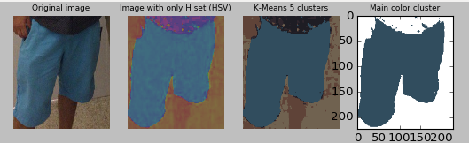
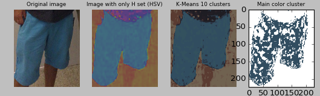

# 1. ros_color_detection

## 2. Description
the project provides a ros node for getting the dominant colors of a given image. The following steps are done:
  * The RGB color image is transformed into HSV Color image
  * The Kmean clustering approach is used on the H of the HSV color image values.
  * The given clusters are named fixing S and V with the average S and V values of the cluster and selecting the webcolor closest to the given value
  * Another simple color name is given fixing V value to 1 and testing Gray, Black an White values through fixed threshold
  
  
  <br/> Color Detection with kmean=3<br/>
  
  <br/> Color Detection with kmean=5<br/>
  
  <br/> Color Detection with kmean=10<br/>
## 3. Authors
* Jacques Saraydaryan

## 4. Configuration
1 launch file is available getting the configuration from the common_color.yaml file:
```python
  #number of dominant color to extract
  kmean_cluster: 3
  #Test image color location
  imgtest_folder: "../data"
  #Displayed resulted clustering currently not working
  is_process_displayed: True
```

## 5. Node

 ### 5.1  Subscribed Topics

  #### /image ([sensor_msgs/Image](http://docs.ros.org/api/sensor_msgs/html/msg/Image.html))
   Incoming images for color detection
        
 ### 5.2 Published Topics
  #### /image_color ([ros_color_detection/ColorDList](https://github.com/jacques-saraydaryan/ros_color_detection/blob/master/ros_color_detection_msgs/msg/ColorD.msg))
   List of dominant colors and associated names

            
 ### 5.3 Services
  #### detect_color_srv ([ros_color_detection/ros_color_detection_srvs](https://github.com/jacques-saraydaryan/ros_color_detection/blob/master/ros_color_detection_srvs/srv/DetectColorFromImg.srv))
   Get main colors of the given image
  
 ### 5.4 Actions
 #### detect_color_action ([ros_color_detection/ros_color_detection_actions](https://github.com/jacques-saraydaryan/ros_color_detection/blob/master/ros_color_detection_actions/action/DetectColorFromImg.action))
 Get main colors of the given image

### 5.5  Params
 ####  kmean_cluster (int,default: 3)
  number of dominant colors processed
 
 #### imgtest_folder (string)
  face_folder contains the initial labeled faces, these images are loaded at the node start
  
 #### is_process_displayed (bool, default: false) 
  display the image processed
